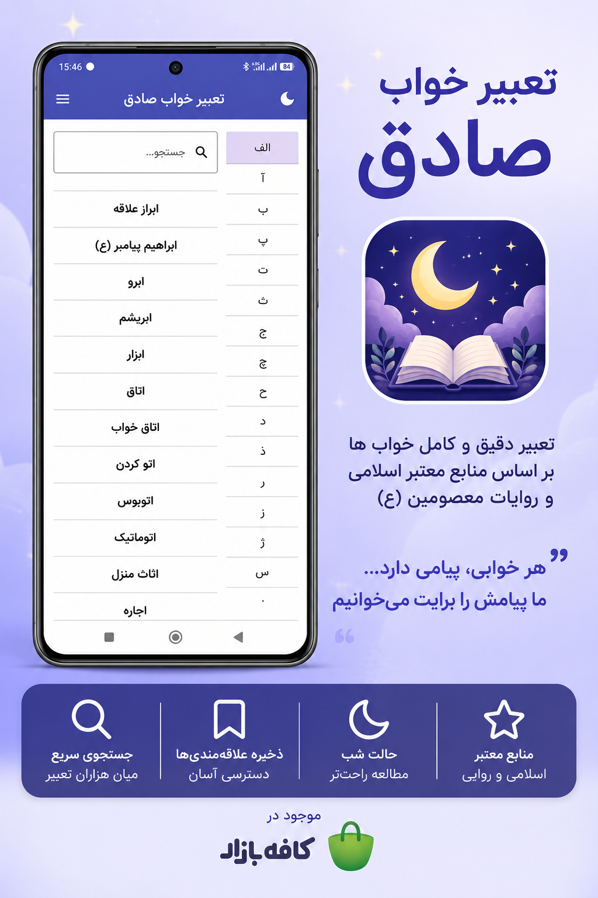
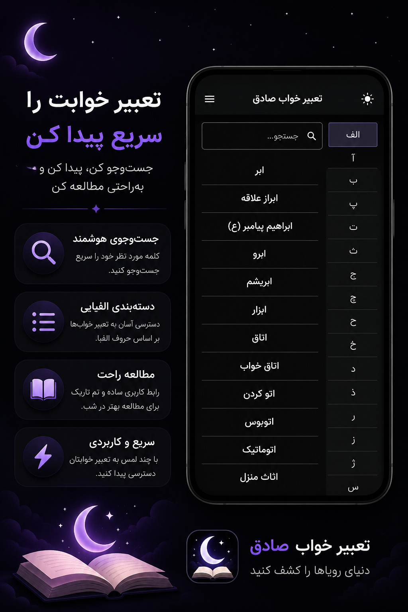
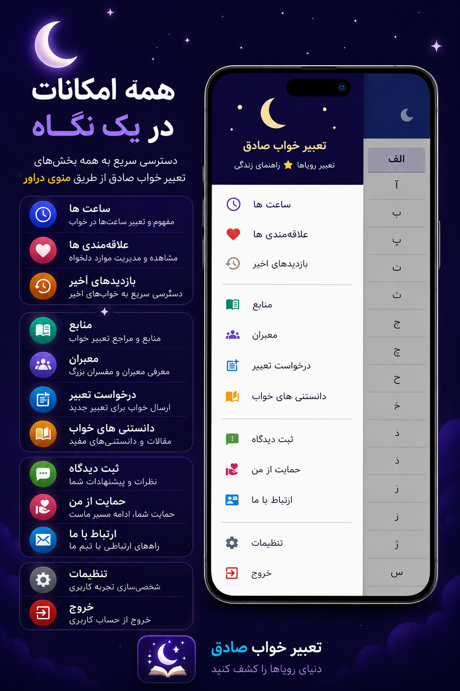
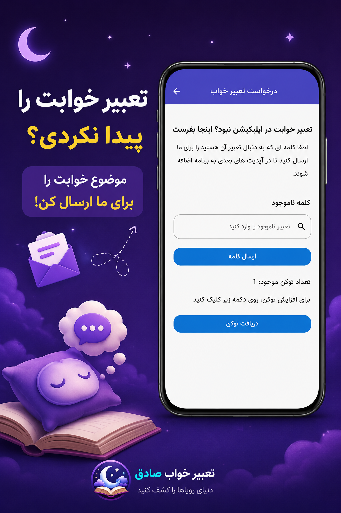
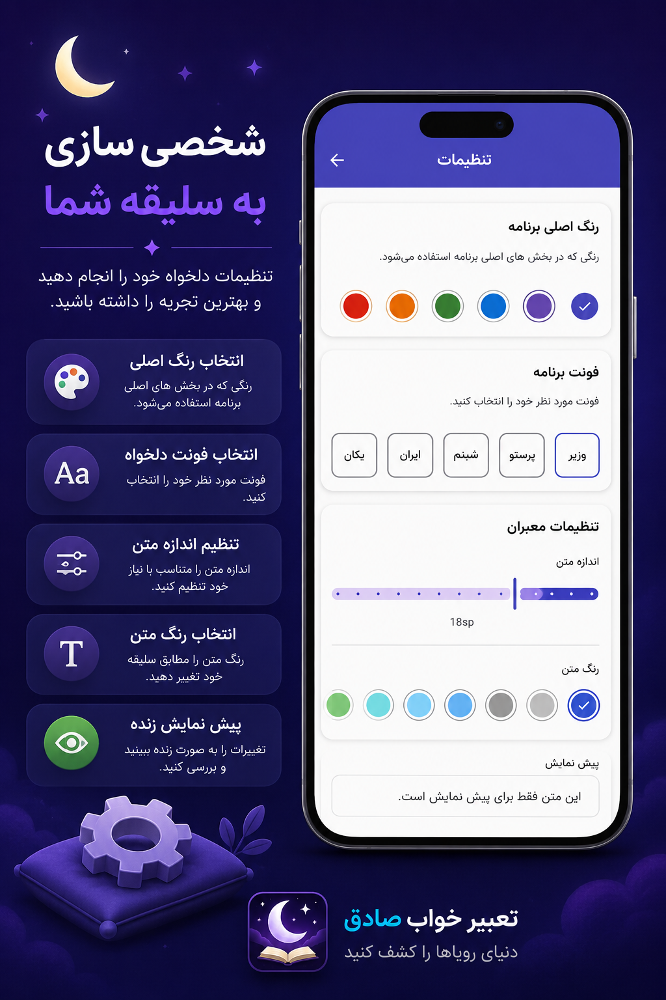
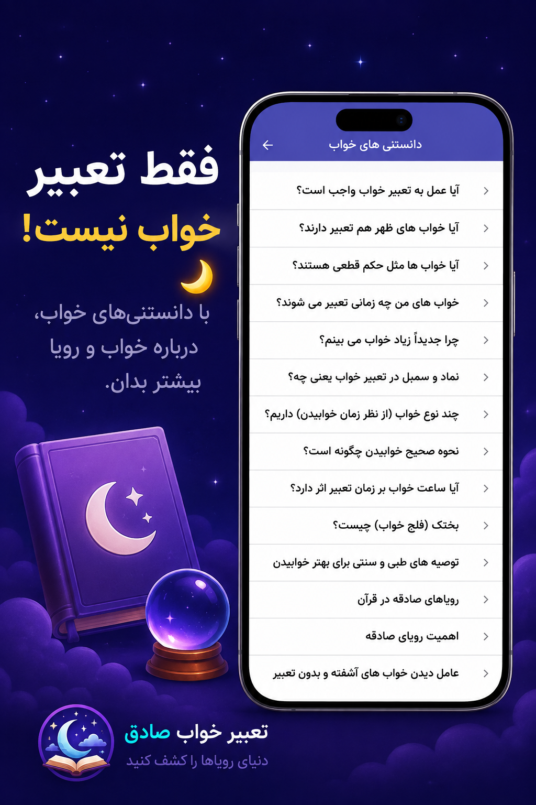

# 🌙 تعبیر خواب صادق - Sadegh Dream

**تعبیر خواب صادق** یک برنامه فارسی برای جست‌وجو و مطالعه تعبیر خواب است که با هدف دسترسی سریع، ساده و منظم به تعبیرهای خواب و مطالب مرتبط توسعه داده شده است.

با جست‌وجوی یک کلمه یا موضوع، می‌توانید تعبیرهای مرتبط را پیدا کنید و آن‌ها را در محیطی ساده و مناسب مطالعه مشاهده کنید.

اگر تعبیر موردنظر شما در برنامه وجود نداشته باشد، می‌توانید درخواست خود را ارسال کنید تا موضوع موردنظر بررسی شود.

---

## ✨ امکانات

### 🔍 جست‌وجوی سریع

با جست‌وجوی یک کلمه یا موضوع، می‌توانید به‌سرعت تعبیرهای مرتبط با خواب خود را پیدا کنید.

### 📚 منابع و معبران

برنامه شامل مجموعه‌ای از تعبیرهای خواب بر اساس منابع و معبران کلاسیک، از جمله **ابن‌سیرین، امام جعفر صادق (ع)** و دیگر معبران است.

### ⭐ درخواست تعبیر خواب

اگر واژه یا موضوع موردنظر شما در برنامه وجود نداشته باشد، می‌توانید از بخش **درخواست تعبیر خواب** درخواست خود را ارسال کنید.

### ❤️ علاقه‌مندی‌ها

تعبیرهای موردنظر خود را به فهرست علاقه‌مندی‌ها اضافه کنید تا در هر زمان بتوانید به آن‌ها دسترسی داشته باشید.

### 🕒 تاریخچه

تعبیرهای مشاهده‌شده در تاریخچه ذخیره می‌شوند تا بتوانید بدون جست‌وجوی دوباره، آن‌ها را مرور کنید.

### 🌙 حالت روشن و تاریک

برنامه از حالت‌های **روشن و تاریک** پشتیبانی می‌کند تا مطالعه در شرایط مختلف راحت‌تر باشد.

### 🎨 شخصی‌سازی ظاهر

ظاهر برنامه را مطابق سلیقه خود شخصی‌سازی کنید.

### ✏️ تنظیمات پیشرفته متن

امکان تغییر موارد زیر برای ایجاد تجربهٔ مطالعه شخصی‌تر فراهم شده است:

* نوع قلم
* اندازه متن
* رنگ متن
* فاصله خطوط

### 📖 رابط کاربری ساده

رابط کاربری برنامه با استفاده از **Jetpack Compose و Material 3** طراحی شده و تمرکز آن بر سادگی، خوانایی و تجربهٔ کاربری مناسب است.

---

## 📱 تصاویر برنامه

  
  
  
  
  
  

---

## 🏗 معماری

این پروژه با استفاده از **Clean Architecture** و الگوی **MVVM** طراحی و توسعه داده شده است.

هدف از استفاده از این معماری، جداسازی مسئولیت‌ها، افزایش قابلیت نگهداری و تست‌پذیری و فراهم کردن ساختاری مناسب برای توسعه آیندهٔ برنامه است.

ساختار معماری پروژه، رابط کاربری، منطق برنامه و مدیریت داده‌ها را از یکدیگر جدا می‌کند.

### 🧩 الگوها و ابزارهای معماری

در پروژه از موارد زیر استفاده شده است:

* **MVVM**
* **Clean Architecture**
* **Repository Pattern**
* **Dependency Injection**
* **ViewModel**
* **Kotlin Coroutines**
* **Kotlin Flow**

این ساختار باعث شده است منطق برنامه، رابط کاربری و دسترسی به داده‌ها از یکدیگر جدا باشند و توسعه و نگهداری پروژه ساده‌تر شود.

---

## 🛠 فناوری‌های استفاده‌شده

### Android

* **Kotlin**
* **Jetpack Compose**
* **Material 3**
* **Android Jetpack**

### Architecture

* **MVVM**
* **Clean Architecture**
* **Repository Pattern**
* **Hilt**

### Data & Storage

* **Room Database**
* **DataStore**

### Asynchronous Programming

* **Kotlin Coroutines**
* **Kotlin Flow**

---

## 💾 مدیریت داده‌ها

برای ذخیره و مدیریت اطلاعات مختلف برنامه از روش‌های متفاوتی استفاده شده است.

### Room Database

از **Room** برای داده‌هایی که نیاز به ساختار پایدار و قابلیت مدیریت محلی دارند استفاده شده است.

### DataStore

از **DataStore** برای نگهداری تنظیمات و اطلاعات سبک برنامه استفاده شده است؛ از جمله تنظیمات مربوط به ظاهر و وضعیت‌های کاربر.

---

## 🎨 رابط کاربری

رابط کاربری برنامه با **Jetpack Compose** و **Material 3** طراحی شده است.

برنامه از قابلیت‌هایی مانند:

* طراحی واکنش‌گرا
* حالت روشن و تاریک
* شخصی‌سازی رنگ‌ها
* انتخاب قلم
* تغییر اندازه متن
* تغییر رنگ متن
* تنظیم فاصله خطوط
* رابط کاربری مناسب مطالعه

پشتیبانی می‌کند.

---

## 📥 دانلود

### [📱 دانلود تعبیر خواب صادق](https://cafebazaar.ir/apps/io.github.sadeghit.dream)

---

## 🎯 هدف پروژه

هدف **تعبیر خواب صادق** ایجاد یک مرجع ساده و کاربردی برای جست‌وجو و مطالعه تعبیر خواب به زبان فارسی است.

به‌جای جست‌وجوی پراکنده در وب‌سایت‌ها و منابع مختلف، کاربر می‌تواند تعبیرهای موردنظر خود را در یک محیط منظم و مناسب مطالعه پیدا کند.

---

## 👨‍💻 توسعه‌دهنده

**صادق آی تی**

توسعهٔ این برنامه با تمرکز بر:

* طراحی مدرن اندروید
* تجربهٔ کاربری ساده
* معماری قابل توسعه
* عملکرد مناسب
* شخصی‌سازی تجربه مطالعه

انجام شده است.

---

# 🌙 Sadegh Dream Interpretation

**Sadegh Dream Interpretation** is a Persian Android application designed to provide a simple and organized way to search for and read dream interpretations.

Users can search for a word or topic related to their dream and quickly explore the available interpretations in a clean and comfortable reading environment.

If a requested dream interpretation is not available, users can also submit a request directly through the application.

---

## ✨ Features

### 🔍 Fast Dream Search

Quickly search for a word or topic and find the available dream interpretations.

### 📚 Traditional Sources and Classical Interpreters

The application provides dream interpretations based on traditional sources and classical interpreters, including **Ibn Sirin, Imam Ja'far al-Sadiq**, and other interpreters.

### ⭐ Request a Missing Interpretation

Can't find the dream word or topic you're looking for?

Submit a request directly through the application.

### ❤️ Favorites

Save your favorite interpretations and access them easily whenever you need them.

### 🕒 Browsing History

Previously viewed interpretations are stored in your history so you can revisit them without searching again.

### 🌙 Light and Dark Mode

Choose between light and dark mode for a more comfortable reading experience.

### 🎨 Customizable Appearance

Customize the appearance of the application according to your preferences.

### ✏️ Advanced Text Settings

Customize:

* Font family
* Text size
* Text color
* Line spacing

for a more personalized reading experience.

### 📖 Simple User Interface

The application uses **Jetpack Compose and Material 3** to provide a clean, modern, and comfortable user interface.

---

## 📱 Screenshots

  
  
  

  
  
  

---

## 🏗 Architecture

The application is built using **Clean Architecture** and the **MVVM** architectural pattern.

The architecture is designed to separate responsibilities between different parts of the application and provide a maintainable and scalable structure.

The architecture separates the user interface, application logic, and data management.

### 🧩 Architecture & Design Patterns

The project uses:

* **MVVM**
* **Clean Architecture**
* **Repository Pattern**
* **Dependency Injection**
* **ViewModel**
* **Kotlin Coroutines**
* **Kotlin Flow**

This structure keeps the UI, application logic, and data access separated, making the project easier to maintain and extend.

---

## 🛠 Built With

### Android

* **Kotlin**
* **Jetpack Compose**
* **Material 3**
* **Android Jetpack**

### Architecture

* **MVVM**
* **Clean Architecture**
* **Repository Pattern**
* **Hilt**

### Data & Storage

* **Room Database**
* **DataStore**

### Asynchronous Programming

* **Kotlin Coroutines**
* **Kotlin Flow**

---

## 💾 Data Management

The application uses different storage solutions depending on the type of data.

### Room Database

**Room** is used for structured local data that requires persistent storage and local database capabilities.

### DataStore

**DataStore** is used for lightweight application settings and preferences, including appearance and user customization settings.

---

## 🎨 User Interface

The application is built with **Jetpack Compose** and **Material 3**.

It supports features such as:

* Responsive UI
* Light and dark themes
* Custom theme colors
* Font selection
* Text size customization
* Text color customization
* Line spacing
* Comfortable reading experience

---

## 📥 Download

### [📱 Download Sadegh Dream Interpretation](https://cafebazaar.ir/apps/io.github.sadeghit.dream)

---

## 🎯 Project Goal

The goal of **Sadegh Dream Interpretation** is to provide a simple and practical Persian reference for searching and reading dream interpretations.

Instead of searching through multiple websites and sources, users can explore dream interpretations and related content in one organized application.

---

## 👨‍💻 Developer

**Sadegh IT**

Developed with a focus on:

* Modern Android development
* Simple user experience
* Scalable architecture
* Efficient performance
* Personalized reading experience
